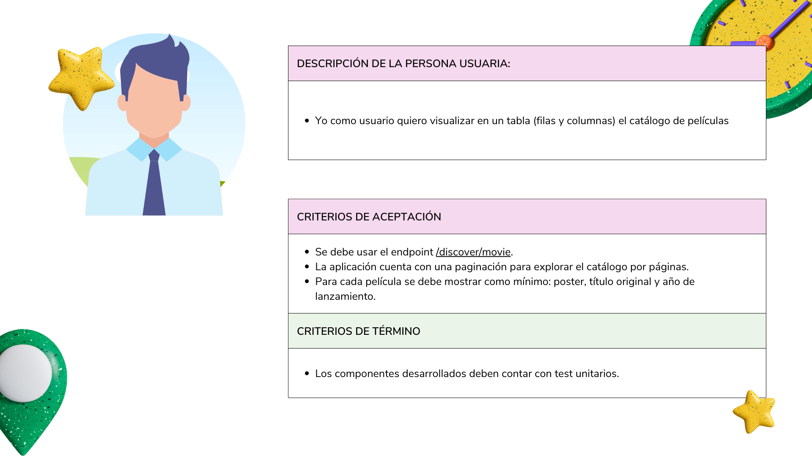
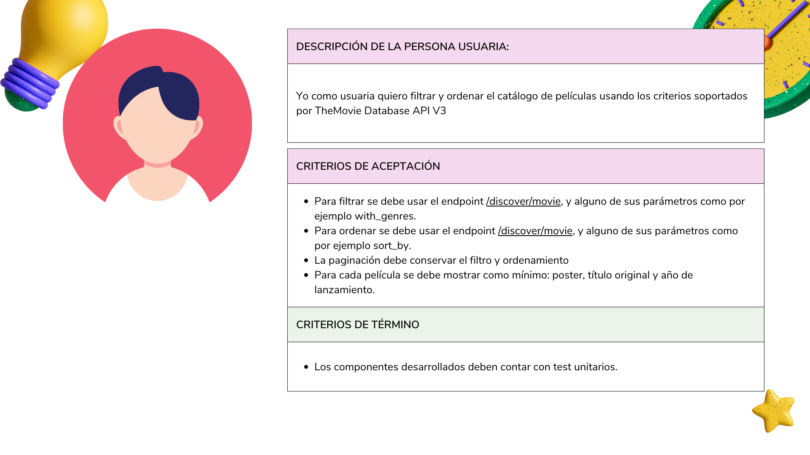
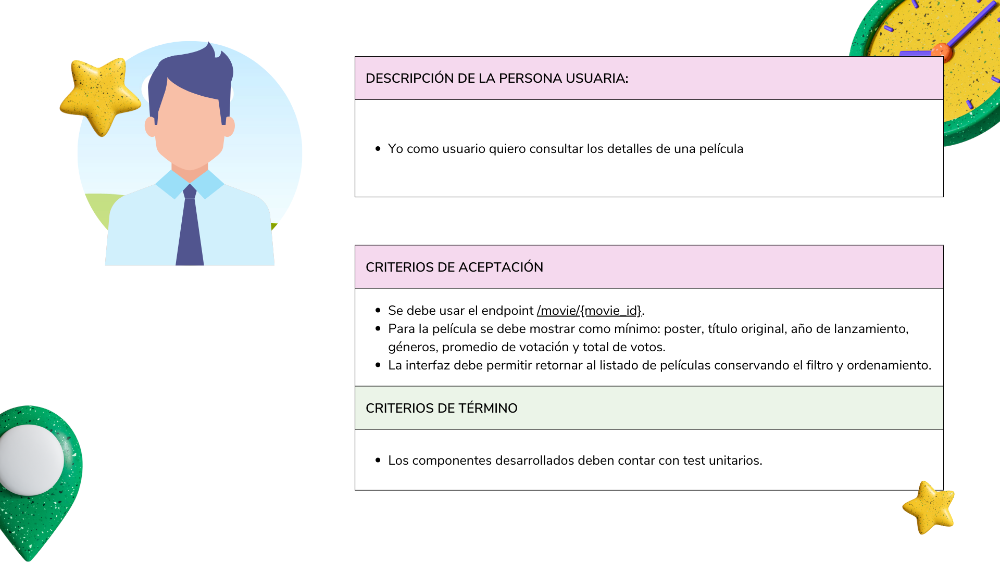
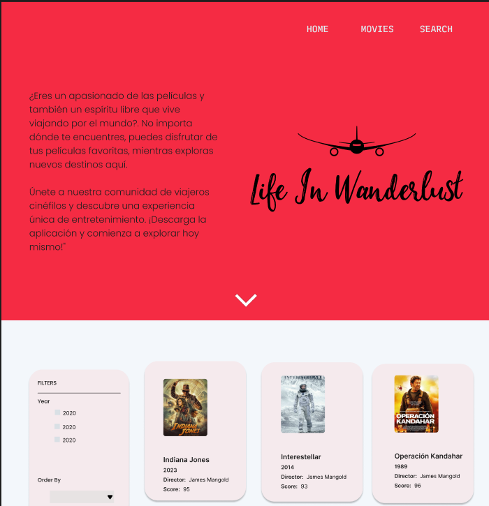
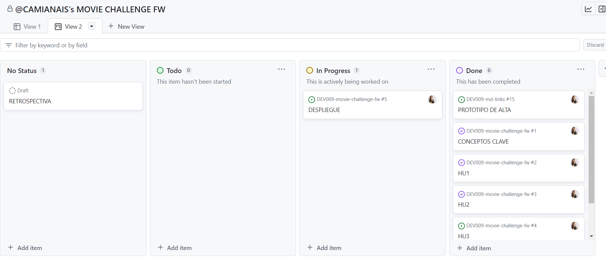
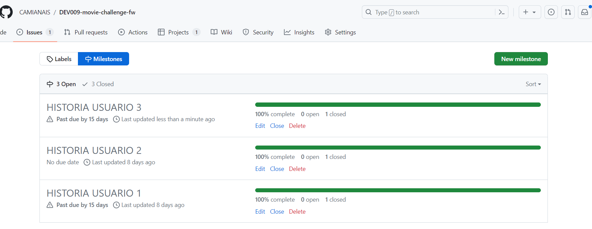
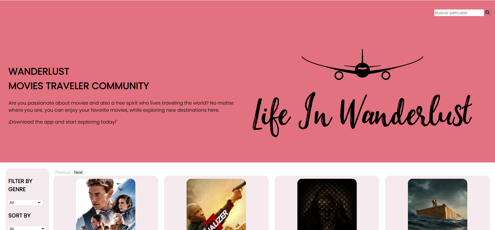

WANDERLUST MOVIES TRAVELER COMMUNITY

## Índice

* [1. Preámbulo](#1-preámbulo)
* [2. Resumen del proyecto](#2-resumen-del-proyecto)
* [3. Herramientas](#3-herramientas)
* [4. Historias de usuario](#4-historias-de-usuario)
* [5. Prototipos](#5-prototipos)
* [6. Planificación del proyecto](#6-planificacion-del-proyecto)
* [7. Resultado](#7-resultado)
***

## 1. Preámbulo

El objetivo del proyecto fue crear una  página web destinada a visualizar, filtrar y ordenar el catálogo de películas de The Movie Database API V3. Esta página puede servir como un catálogo de películas general, diseñada para la comunidad de viajeros cinefilos. En busqueda de una pelicula para compartir en comunidad desde donde se encuentren. 
## 2. Resumen del proyecto

La tematica elegida fue pensada para resolver el reto a la hora de elegir una pelicula.

1.- Los principlaes usuarios del producto son personas que estan viajando constantemente y que al ingresar puedan ver las mejor votada sor la misma comunidad qu ecomparte su pasión por viajar y conocer el mundo.

2.- Los objetivos de los usuarios en relacion con el producto son visualizar, filtrar y ordenar el catálogo de películas.

## 3. Herramientas

Los lenguajes utilizados fueron HTML semántico, CSS y JavaScript, se uso React. Se crearon e implementaron test unitarios de componentes mayor al 90%

## 4. Historias de Usuario

#### Historia de usabilidad 1

#### Historia de usabilidad 2

#### Historia de usabilidad 3

## 5. Prototipos
Se trabajo en la elaboración de un prototipo de alta fidelidad el cual fue evaluado por nuestras compañeras de las cuales recibi feedback para posteriormente y después de aplicar las sugerencias , volver a solicitarles ayuda en el test de usabilidad.

#### Prototipos de alta fidelidad

 Prototipo dinámico: [prototipo dinamico](https://www.figma.com/proto/hLXttWAHbL0dDJdtmLFQcX/MOVIE-CHALLENGE?type=design&node-id=311-130&t=eOM1ymnhRx6fVoFf-1&scaling=min-zoom&page-id=0%3A1&mode=design)

Use para el diseño del protipo [Figma](https://www.figma.com/) 
### Pruebas unitarias

El proyecto cuenta con test para los componentes que incluye tales como MovieAdmin, ListMovies, MovieDetail entre otros, que verifican el correcto renderizado del componente como tal y el redireccionamiento de botones a las rutas correspondientes.

## 6. Planificación del proyecto

Me planifiqué en Git Hub projects, este me ayudo a optimizar mi proceso y hacerle seguimiento a mi avance diario.

## 7. Resultado
